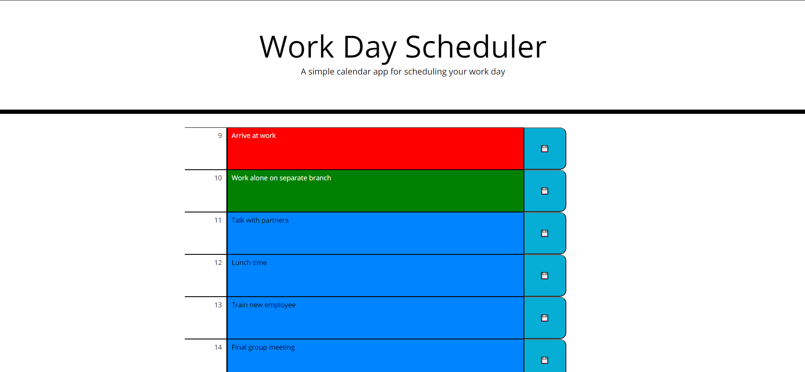

# work-day-scheduler
This is an application that you can edit and save the schedule \
for the day. Colors represent what time it is so that red \
means that it's past that hour, green means it is that hour \
right now, and blue means it is an upcoming hour.

https://justinean.github.io/work-day-scheduler/